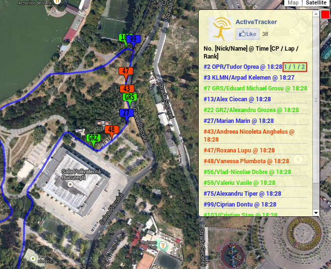
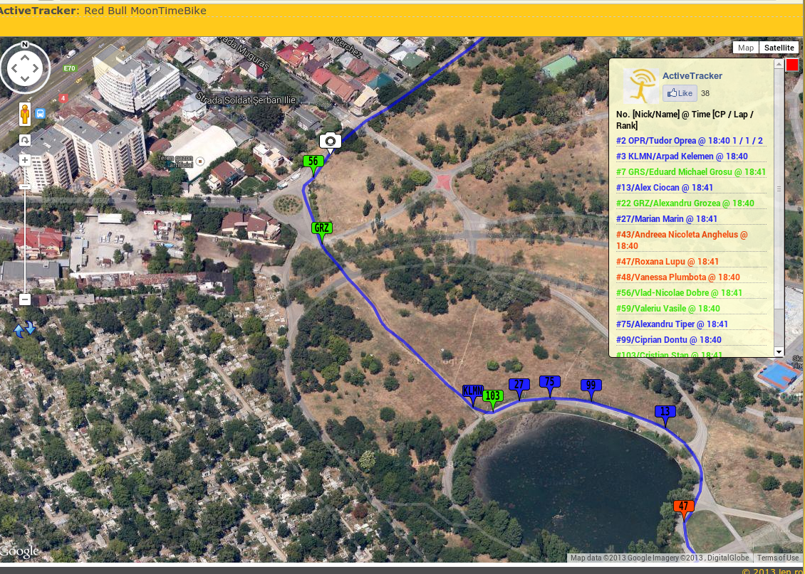
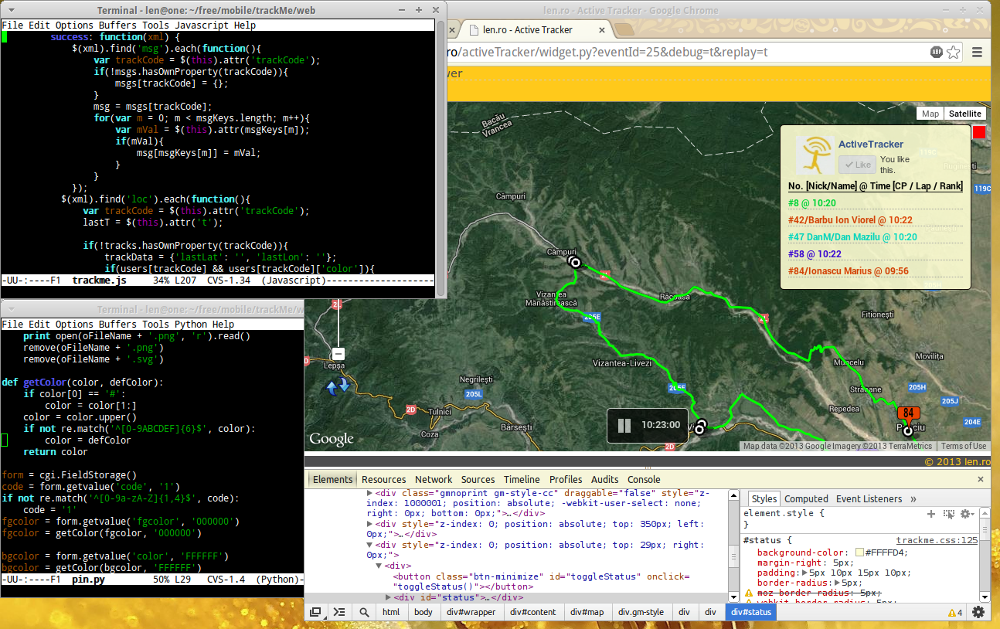
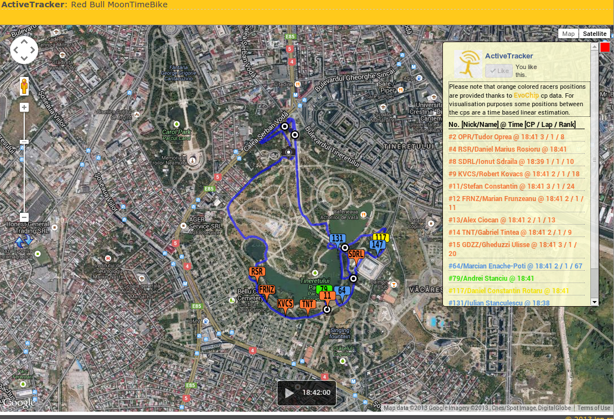

# ActiveTracker

**@deprecated:** This was a skeleton android app and server side python I developed in 2013, to monitor cycling events and display real-data positions on a track.

Development has stopped and I do not intend to provide any support; however I was asked several times to implement a similar system. This
 should provide a starting point for anyone interested to do that.

## Screenshots 

